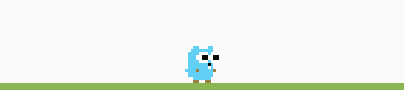

# Hi, I'm Nguyễn Tiến Tài 👨🏼‍🏫, Software Engineer and Teacher 🔥

[;console.log(%22I+code+Javascript%22);console.log(%22and+code+Go%22);console.log(%22and+TypeScript%22))](https://git.io/typing-svg)

I hold a software engineering degree from Nha Trang University. I work as a Web Developer at a software company and also teach programming to students.

- 🎓 Graduated from Nha Trang University with an undergraduate degree.
- 🔥 I am a software engineer and a programming instructor. I work as a programmer for companies' websites.
- 📚 My notes of learning at [codewebkhongkho.com/portfolios](https://codewebkhongkho.com/portfolios) and GitHub.
- 💌 Contact me at [nguyentientai10@gmail.com](mailto:nguyentientai10@gmail.com).

## 📑 Github Stats

# 🚀 Programming Languages Showcase 🌟

  

## 🌐 Frontend

## 💻 Backend

## 🏛️ Database

## ⚙️ DevOps

## 🤖 Source code management

## 🧰 OS & IDE & Tools

## ☁️ Cloud

<!-- run image -->

  
  

## 🌟 About Me & Connect

Chào cả nhà!

Tôi là **Nguyễn Tiến Tài** — một **Lập trình viên Fullstack** với kinh nghiệm làm việc **từ xa (Remote)**. Không chỉ viết code, đam mê lớn của tôi là **giảng dạy và chia sẻ**. Tôi đã có **3 năm đứng lớp** tại các trung tâm lập trình, và giờ đây, tôi tiếp tục sứ mệnh ấy bằng cách mở lớp dạy kèm và học theo video, với vai trò **“thầy giáo dạy lập trình”**! 🧑‍💻📚

Trên hai kênh chính của mình: 
1. 📘 Facebook: [**Code Web Không Khó**](https://www.facebook.com/codewebkhongkho)
2. 🎵 TikTok: [**Code Web Không Khó**](https://www.tiktok.com/@code.web.khng.kh)

Tôi tập trung chia sẻ những nội dung **thực tế, hữu ích**, các bạn có thể ghé và xem nhé!

Tôi luôn tâm niệm: **Kiến thức chỉ thực sự có giá trị khi được lan tỏa một cách gần gũi và dễ áp dụng nhất.** Mong rằng những chia sẻ của tôi sẽ giúp các bạn trẻ yêu thích công nghệ tiến gần hơn đến nghề nghiệp mơ ước.

Nếu bạn quan tâm đến **Fullstack Development, làm việc Remote**, hoặc đơn giản là muốn học lập trình một cách **“không khó, không khô”**, hãy ghé thăm và theo dõi 2 kên của tôi nhé!

📬 **Liên hệ công việc & hợp tác:** [nguyentientai10@gmail.com](mailto:nguyentientai10@gmail.com)  
🌐 **Portfolio & thông tin cá nhân:** [codewebkhongkho.com/portfolios](https://codewebkhongkho.com/portfolios)

*Cảm ơn sự quan tâm và ủng hộ của mọi người! Hẹn gặp trên TikTok,Facebook và qua những dòng code đầy cảm hứng!* 💻✨
